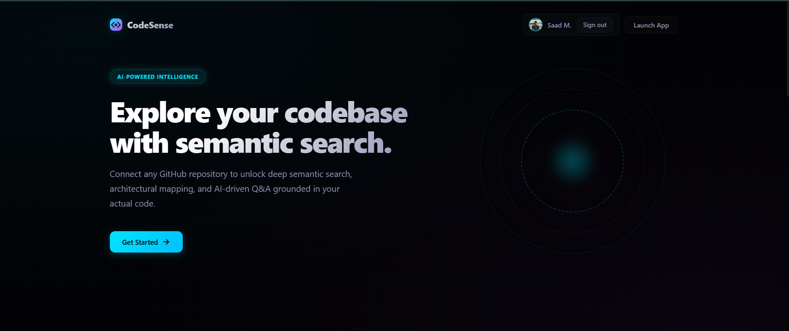
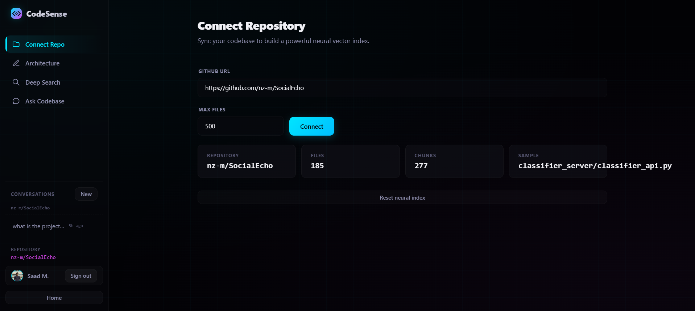
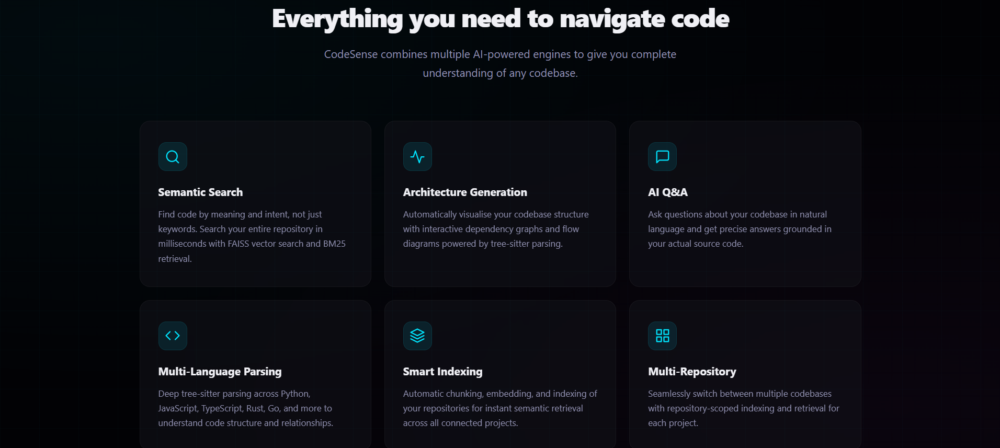
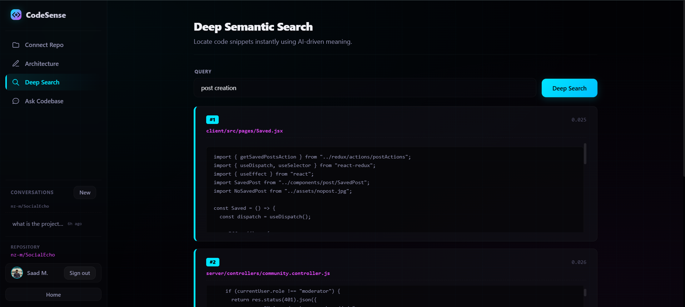
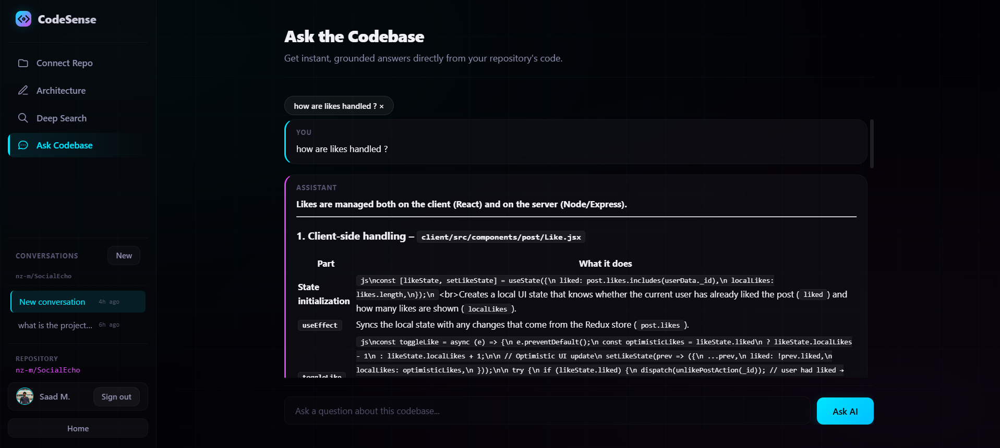

<h1 align="center">CodeSense</h1>

<p align="center">
  <b>AI-powered code intelligence platform that understands GitHub repositories.</b>
</p>

<p align="center">
  <a href="https://code-sense.pages.dev">Live Demo</a> ·
  <a href="https://github.com/MohdSaadMa07/Code-Sense">GitHub</a>
</p>

<p align="center">
  
  
  
  
  
  
  
  
  
</p>

---

Connect any GitHub repository and instantly get:

- **Semantic search** across your entire codebase
- **Automatic architecture diagrams** generated from code structure
- **AI-powered codebase Q&A** grounded in your actual source
- **Symbol-level code exploration** across 20+ languages

Built with FastAPI, React, FAISS, BM25, ONNX Runtime, and Groq RAG.

## At a Glance

| | |
|---|---|
| **Languages** | 20+ supported (Python, JS, TS, Rust, Go, Java, etc.) |
| **Max files per repo** | 500 |
| **Embedding dimensions** | 384 (ONNX) / 1024 (Jina) |
| **Retrieval** | Hybrid FAISS + BM25 + RRF fusion |
| **Auth** | Google OAuth + JWT |
| **Indexing** | Thread-safe, persistent, atomic saves |
| **Parsing** | AST-aware (tree-sitter + Python `ast`) |
| **Deployment** | Render.com + Cloudflare Pages |

## Screenshots

### Landing Page



### Connect Repository



### Architecture Diagram



### Deep Semantic Search



### AI Codebase Q&A



## Why CodeSense?

Modern codebases are difficult to understand because:

- Documentation becomes outdated the moment it's written
- Large repositories require hours of manual exploration
- Onboarding into unfamiliar systems is slow and painful
- Finding the right code by keyword search misses semantic context

CodeSense solves this by creating an **AI intelligence layer** over repositories:

- **Hybrid retrieval** (semantic + lexical) finds code by meaning, not just keywords
- **AST-based parsing** understands code structure at the symbol level
- **RAG-based reasoning** answers questions using actual source code as context
- **Automated architecture discovery** reverse-engineers system diagrams from imports and routes

## Highlights

- Hybrid retrieval (FAISS + BM25 + RRF)
- AST-aware chunking using tree-sitter (20+ languages)
- Local ONNX fallback when remote embeddings are unavailable
- Automatic architecture diagram generation from code analysis
- Thread-safe per-repository indexing with atomic persistence
- AI-powered codebase Q&A with confidence scoring
- Conversation history with Google OAuth + JWT auth

## Features

| Feature | Description |
|---|---|
| **Semantic Search** | Hybrid FAISS + BM25 retrieval with Reciprocal Rank Fusion, re-ranked by parse quality and query intent |
| **Architecture Generation** | Scans route definitions, classifies endpoints into 22 functional domains, detects layers, builds dependency graphs, renders Mermaid.js diagrams |
| **AI Q&A** | Retrieval-Augmented Generation using Groq LLM — retrieved code chunks are injected as context for grounded answers |
| **Multi-Language Parsing** | Tree-sitter AST extraction for 20+ languages; Python files also use built-in `ast` for symbol boundaries |
| **Smart Indexing** | Deterministic chunk IDs (SHA1), noise filtering, parse quality metadata, per-repo thread-safe ingestion |
| **Thread-Safe Repository Indexing** | Per-repository locking, atomic persistence via temp-dir rename, LRU caching (max 5 repos) to prevent concurrent conflicts |

## Tech Stack

<p align="center">
  
  
  
  
  
  
  
  
</p>

### Backend

| Component | Technology |
|---|---|
| API Framework | FastAPI (Python 3.12) |
| Database | SQLAlchemy + SQLite / PostgreSQL |
| Auth | Google OAuth 2.0 + JWT (HS256) |
| LLM | Groq — `openai/gpt-oss-120b` |
| Embeddings | Jina AI v3 (1024-dim) or BGE ONNX (384-dim) |
| Vector Search | FAISS `IndexFlatIP` |
| Lexical Search | BM25+ (k1=1.2, b=0.75) |
| Fusion | Reciprocal Rank Fusion (k=60) |
| Code Parsing | tree-sitter (20+ lang) + Python `ast` |
| Chunking | AST-aware, chunk size 3000, overlap 50 |

### Frontend

| Component | Technology |
|---|---|
| Framework | React 19 |
| Markdown | react-markdown 10 + remark-gfm 4 |
| Diagrams | Mermaid.js 10 |
| Auth | Google Identity Services |
| Styling | Custom CSS (dark cyber/neon theme) |
| Hosting | Cloudflare Pages |

## Architecture Overview

```
GitHub Repository
        │
        ▼
  GitHub API (parallel download, 3 threads)
        │
        ▼
  AST Chunking (tree-sitter / Python ast)
        │
        ▼
  Embedding (Jina AI v3 or BGE ONNX)
        │
   ┌────┴────┐
   │         │
 FAISS      BM25
(vectors)  (lexical)
   │         │
   └────┬────┘
        ▼
  Reciprocal Rank Fusion (k=60)
        │
        ▼
  Groq LLM (RAG)     Frontend (React 19)
        │                    │
        └────────┬───────────┘
                 ▼
           User (Cloudflare Pages)
```

Deployment: FastAPI on Render.com, React SPA on Cloudflare Pages.

Full architecture, ingestion pipeline, and RAG details → [docs/architecture.md](docs/architecture.md)

## Performance

| Metric | Value |
|---|---:|
| Supported languages | 20+ |
| Embedding dimensions | 384 / 1024 |
| Maximum indexed files per repo | 500 |
| Retrieval methods | FAISS + BM25 + RRF |
| RRF fusion parameter | k=60 |
| Cache size (in-memory repos) | 5 (LRU) |
| Index persistence | Disk (atomic save) |

## Documentation

- [Architecture & Pipelines](docs/architecture.md) — Full system architecture, ingestion flow, RAG flow, deployment topology
- [Retrieval System](docs/retrieval.md) — Embedding strategies, hybrid search pipeline, re-ranking, confidence scoring
- [API Reference](docs/api.md) — Complete endpoint documentation with request/response examples

## Directory Structure

```
code-app/
├── code-app/
│   ├── app/
│   │   ├── main.py                 # FastAPI entrypoint
│   │   ├── database.py             # SQLAlchemy setup
│   │   ├── deps.py                 # JWT dependencies
│   │   ├── models.py               # ORM: User, Conversation, Message
│   │   ├── routes/                 # API endpoints (8 modules)
│   │   ├── services/               # Business logic
│   │   │   ├── retrieval/          # FAISS, BM25, Manager, Cache
│   │   │   ├── ast_chunker.py      # Python AST chunking
│   │   │   ├── tree_sitter_chunker.py  # Multi-lang chunking
│   │   │   ├── github_loader.py    # GitHub API fetcher
│   │   │   ├── gpt_rag.py          # RAG pipeline
│   │   │   ├── onnx_embeddings.py  # Local BGE ONNX
│   │   │   ├── remote_embeddings.py # Jina API
│   │   │   └── storage.py          # Ingestion pipeline
│   │   └── data/                   # SQLite (gitignored)
│   ├── requirements.txt
│   └── vectorstore/                # FAISS/BM25 indices
├── frontend/
│   ├── src/
│   │   ├── App.js                  # Main component
│   │   ├── App.css                 # Full stylesheet
│   │   └── AuthContext.js          # Google OAuth
│   └── package.json
├── docs/                           # Detailed documentation
│   ├── architecture.md
│   ├── retrieval.md
│   └── api.md
└── README.md
```

## Setup

### Environment Variables

| Variable | Required | Description |
|---|---|---|
| `GROQ_API_KEY` | Yes | Groq API key for LLM queries |
| `JWT_SECRET` | Yes | Secret for JWT signing (HS256) |
| `GOOGLE_CLIENT_ID` | Yes | Google OAuth client ID |
| `GITHUB_TOKEN` | Recommended | GitHub API token (higher rate limits) |
| `VOYAGE_API_KEY` | Optional | Voyage AI embeddings (`voyage-code-3`, 1024-dim; falls back to local ONNX) |
| `DATABASE_URL` | Optional | PostgreSQL connection string (default: SQLite) |

### Local Development

```bash
# Backend
cd code-app
pip install -r requirements.txt
uvicorn app.main:app --reload --port 8000

# Frontend
cd frontend
npm install
npm start
```

### Production Deployment

| Platform | Service | Details |
|---|---|---|
| **Render.com** | FastAPI backend | `uvicorn app.main:app --host 0.0.0.0 --port $PORT` |
| **Cloudflare Pages** | React SPA | `npm run build`, output `build/`, `_redirects` for SPA routing |

## Security

- JWT tokens expire after 30 days
- Google OAuth token validation via Google's tokeninfo endpoint with audience verification
- CORS restricted to `localhost:3000` and `*.code-sense.pages.dev`
- Per-repository thread locks prevent concurrent index corruption
- Atomic index saves (write to temp, rename on success)
- `.env` files are gitignored — never commit secrets

## License

MIT
